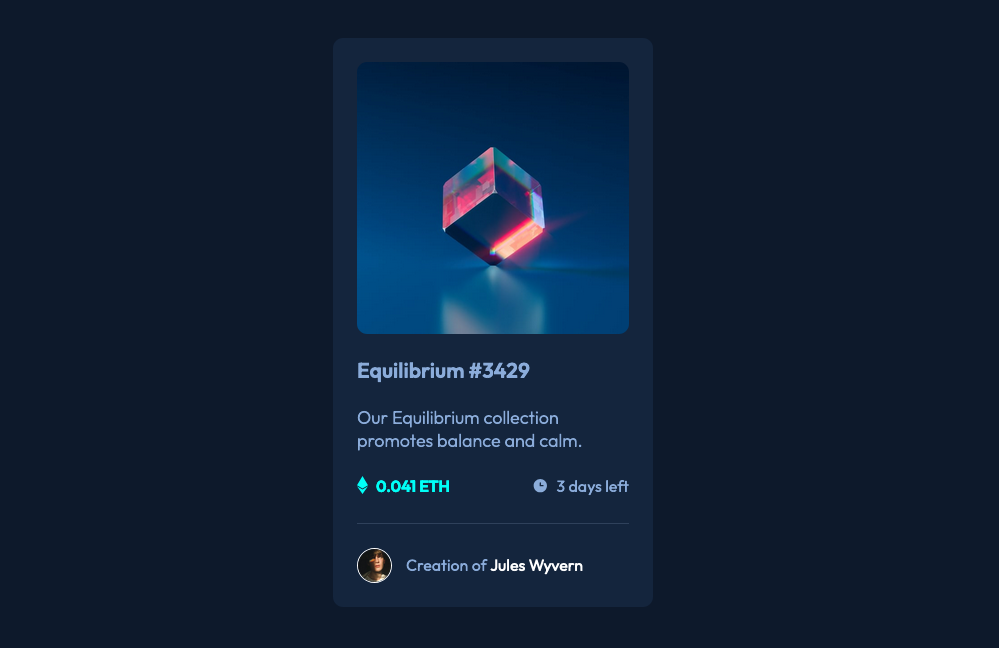

# NFT preview card component solution

This is a solution to the [NFT preview card component challenge on Frontend Mentor](https://www.frontendmentor.io/challenges/nft-preview-card-component-SbdUL_w0U).

## Table of contents

- [NFT preview card component solution](#nft-preview-card-component-solution)
  - [Table of contents](#table-of-contents)
  - [Overview](#overview)
    - [The challenge](#the-challenge)
    - [Screenshot](#screenshot)
    - [Links](#links)
  - [My process](#my-process)
    - [Built with](#built-with)
    - [What I learned](#what-i-learned)
      - [HTML:](#html)
      - [CSS:](#css)
    - [Useful resource](#useful-resource)
  - [Author](#author)
  

## Overview

### The challenge

Users should be able to:

- View the optimal layout depending on their device's screen size
- See hover states for interactive elements

### Screenshot



### Links

  - Solution URL: [HTML](https://github.com/MBaktygul/nft-preview-card-component-main/blob/main/index.html), [CSS](https://github.com/MBaktygul/nft-preview-card-component-main/tree/main/styles)
- Live Site URL: [NFT card component](mbaktygul.github.io/nft-preview-card-component-main/)

## My process

### Built with

- Semantic HTML5 markup
- Scss
- Flexbox
- Mobile-first workflow

### What I learned

#### HTML:
An image ```img``` is wrapped in a div ```.img__wrapper``` with an overlay div ```.img-overlay``` that contains an eye icon (SVG).

#### CSS:
The wrapper is ```position: relative;```, and the overlay is ```position: absolute;``` to cover the image fully.
The overlay starts invisible ```opacity: 0;``` and becomes visible on hover ```opacity: 1;```.

The icon is centered using ```flexbox```.

### Useful resource

- [Opacity with Box (W3Schools) ](https://www.w3schools.com/howto/tryit.asp?filename=tryhow_css_image_overlay_opacity) - This helped me with an overlay.

## Author

- Website - [Baktygul](https://github.com/MBaktygul)
- Frontend Mentor - [@MBaktygul](https://www.frontendmentor.io/profile/MBaktygul)

